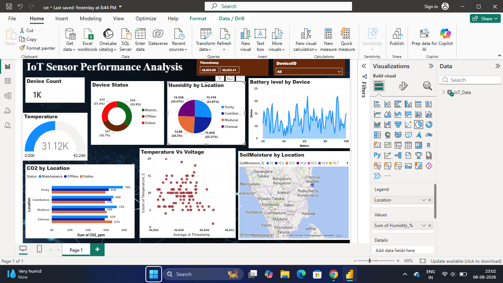

# Iot-Sensor-Performance-Analysis
 An interactive Power BI dashboard designed to analyze IoT sensor data and provide insights into device performance, environmental conditions, battery levels, CO₂ levels, and sensor locations. 
 
##  Tools Used

- Power BI
- Microsoft Excel
- DAX
- Data Visualization

## Dashboard

##  Dashboard Features

- Device Status Analysis
- Temperature Monitoring
- Humidity by Location
- Battery Level Analysis
- CO₂ Analysis
- Temperature vs Voltage
- Soil Moisture Analysis
- Interactive Timestamp and DeviceID Filters

## Dataset

The dataset contains 1,000+ IoT sensor records with multiple
environmental and device-performance parameters.

## Key Insights

The dashboard enables users to analyze IoT device performance
and identify patterns across locations and sensor measurements.

## 👩‍💻 Author

Devadharshini Esther D
