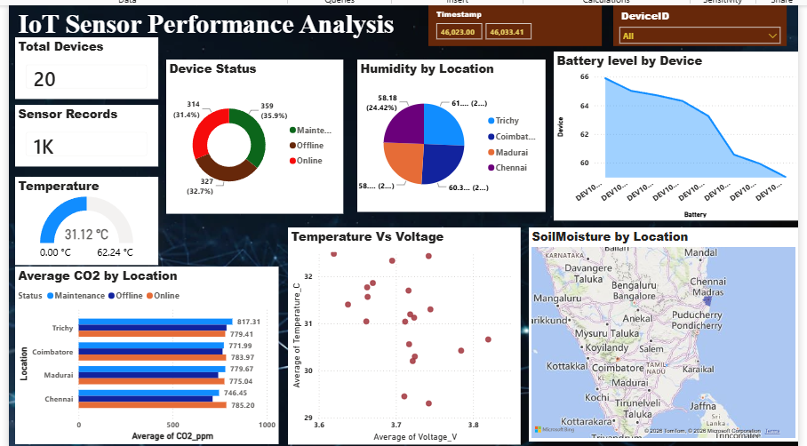

# IoT Sensor Performance Analysis

## 📊 Project Overview

This project analyzes IoT sensor data to monitor device performance, environmental conditions, power-related measurements, and device health across multiple locations.

An interactive **Microsoft Power BI dashboard** was developed to transform raw sensor records into meaningful visual insights and enable users to explore the data using filters.

---

## 🎯 Objectives

- Analyze IoT sensor readings across multiple devices and locations.
- Monitor environmental parameters such as temperature, humidity, CO₂, pressure, light, and soil moisture.
- Analyze battery, voltage, current, and energy measurements.
- Monitor device operating status.
- Analyze sensor connectivity using signal RSSI.
- Compare sensor measurements across different locations.
- Build an interactive Power BI dashboard for IoT performance monitoring.

---

## 📁 Dataset

The dataset contains **1,000 sensor records from 20 unique IoT devices** across **4 locations**.

### Dataset Features

| Column | Description |
|---|---|
| `Timestamp` | Date and time of the sensor reading |
| `DeviceID` | Unique identifier of the IoT device |
| `Location` | Location of the device |
| `Temperature_C` | Temperature reading in °C |
| `Humidity_%` | Relative humidity percentage |
| `CO2_ppm` | Carbon dioxide concentration in ppm |
| `Pressure_hPa` | Atmospheric pressure in hPa |
| `Light_lux` | Light intensity in lux |
| `SoilMoisture_%` | Soil moisture percentage |
| `Battery_%` | Device battery level |
| `Voltage_V` | Voltage measurement |
| `Current_A` | Current measurement |
| `Energy_kWh` | Energy consumption |
| `Signal_RSSI` | Wireless signal strength |
| `Status` | Device status: Online, Offline, or Maintenance |

---

## 🧹 Data Preparation

The sensor dataset was prepared before visualization and analysis.

The data preparation process included:

- Reviewing the dataset structure and fields.
- Validating data types.
- Preparing timestamp and categorical fields.
- Using appropriate aggregations for sensor measurements.
- Using **Distinct Count** to identify unique devices.
- Preparing the dataset for Power BI analysis.

---

## 📈 Power BI Dashboard

The dashboard provides an interactive overview of IoT sensor performance.

### Key KPIs

- **Total Devices:** 20
- **Sensor Records:** 1,000
- **Average Temperature:** 31.12°C

### Dashboard Visualizations

The dashboard includes:

- **Device Status Distribution**
- **Average Humidity by Location**
- **Average Battery Level by Device**
- **Average CO₂ Level by Location**
- **Temperature vs. Voltage**
- **Soil Moisture by Location**
- **Timestamp filter**
- **Device ID filter**

---

## 🖥️ Dashboard Preview



---

## 🔍 Analysis & Insights

### Device Status

The 1,000 sensor records are categorized into three device states:

| Status | Records | Percentage |
|---|---:|---:|
| Online | 359 | 35.9% |
| Offline | 327 | 32.7% |
| Maintenance | 314 | 31.4% |
| **Total** | **1,000** | **100%** |

The dashboard provides a clear view of the distribution of sensor records across Online, Offline, and Maintenance states.

### Environmental Analysis

Temperature, humidity, CO₂, and soil moisture are compared across different locations to identify variations in environmental conditions.

The overall average temperature shown in the dashboard is approximately **31.12°C**.

### Battery Performance

Average battery levels are analyzed for the 20 unique devices, allowing device-level comparison of battery performance.

### CO₂ Analysis

Average CO₂ levels are compared across the four locations to identify differences in measured carbon dioxide concentration.

### Temperature and Voltage Relationship

A scatter plot is used to visually examine the relationship between **temperature and voltage** measurements.

### Soil Moisture Analysis

Soil moisture measurements are visualized geographically to provide a location-based view of the sensor readings.

---

## 🛠️ Tools & Technologies

- **Microsoft Power BI**
- **Power Query**
- **DAX**
- **Microsoft Excel**

---

## 📊 Dashboard Features

The dashboard allows users to:

- Filter sensor data by timestamp.
- Filter data by Device ID.
- Compare environmental measurements across locations.
- Compare battery performance between devices.
- Analyze device status distribution.
- Explore the relationship between temperature and voltage.
- Examine location-based sensor measurements.

---

## 📂 Project Files

```text
IoT-Sensor-Performance-Analysis/
│
├── dashboard-preview.png
├── IoT_Sensor_Dataset.xlsx
├── iot.pbit
└── README.md
